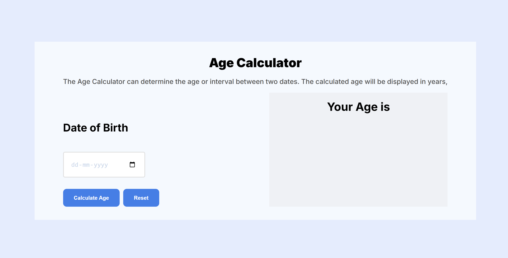

# 🎂 Age Calculator App

A user-friendly **Age Calculator** built with **React.js** that helps users determine their exact age based on the selected birthdate.

## 📸 Screenshot 🖼️


## ✨ Features
- 📅 Select birthdate using a date picker.
- ⏳ Real-time age calculation in years, months, and days.
- 🔁 Dynamic updates on date change.
- 🖥️ Clean and responsive UI.
- 🧮 Accurate date logic using JavaScript Date object.

## 🛠️ Technologies Used
- ⚛️ **React.js** – Component-based UI
- 📦 **npm create vite@latest** – React boilerplate
- 🎨 **CSS** – Styling (choose based on setup)
- 🗓️ **Date object** – Native JavaScript date functions

## 📂 Project Structure
```
📁 age-calculator/
│-- 📄 README.md         (Project documentation)
│-- 📄 package.json      (Dependencies & scripts)
│-- 📁 public/
│   └── index.html
│-- 📁 src/
│   │-- 📄 App.js         (Main component)
│   │-- 📄 index.js       (Entry point)
│   │-- 📁 components/    (Custom components if any)
│   └── 📄 index.css        (Styling)
```

## 📥 Installation & Usage
1. Clone the repository:
   ```bash
   git clone https://github.com/shelavalepallavi/age-calculator.git
   ```
2. Navigate to the project folder:
   ```bash
   cd age-calculator
   ```
3. Install dependencies:
   ```bash
   npm install
   ```
4. Start the development server:
   ```bash
   npm run dev
   ```
5. Open your browser and visit `http://localhost:5173`

## 🎯 How to Use
1. 🧑 Enter or pick your birthdate from the calendar
2. ⌛ Instantly view your exact age in years, months, and days
3. 🔄 Change the date to update the result

## 💡 Future Enhancements
- 📆 Add countdown to next birthday
- 🌐 Support for time zones
- 📱 Shareable result summary
- 🗓️ Calculate age differences between two dates

## 🤝 Contributing
Found a bug or want to contribute a feature? Fork the repo, create a branch, and submit a pull request. Contributions are always welcome! 🙌

